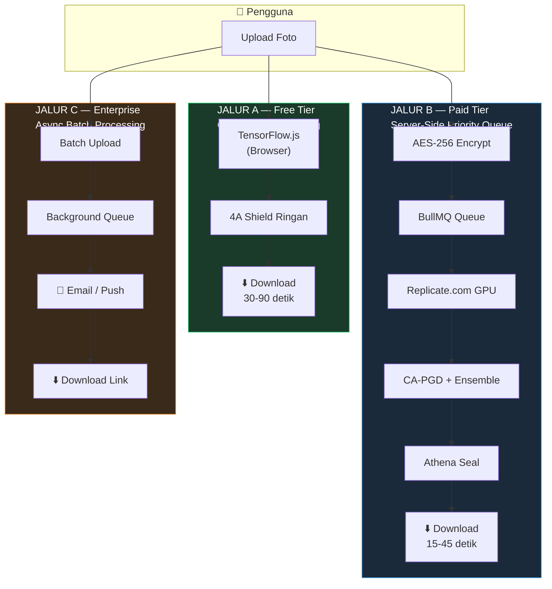

<p align="center">
  
</p>

<h1 align="center">A.T.H.E.N.A</h1>
<h3 align="center">Advanced Threat Handling & Encryption Network Application</h3>
<p align="center"><em>Platform Perlindungan Visual Berbasis AI untuk Karya Lokal Indonesia</em></p>

<p align="center">
  <strong>「 Turn Your Image Into Invisible — Untrackable, Untrainable, Yours. 」</strong>
</p>

<br/>

<p align="center">
  
  
  
  
</p>

<p align="center">
  
  
  
  
  
  
  
  
  
  
  
  
  
  
</p>

---

## Daftar Isi

- [Tentang ATHENA](#tentang-athena)
- [Masalah yang Diselesaikan](#masalah-yang-diselesaikan)
- [Solusi: 4A Shield](#solusi-4a-shield)
- [Arsitektur Sistem](#arsitektur-sistem)
- [Tech Stack](#tech-stack)
- [Model Bisnis](#model-bisnis)
- [Roadmap & Timeline](#roadmap--timeline)
- [Struktur Repository](#struktur-repository)
- [Cara Menjalankan](#cara-menjalankan)
- [Untuk Dewan Juri](#untuk-dewan-juri)
- [Tim](#tim)
- [Lisensi](#lisensi)

---

## Tentang ATHENA

**ATHENA** adalah platform SaaS pertama di Indonesia yang memungkinkan siapa pun — dari pengrajin batik UMKM, seniman wayang, kreator konten, hingga individu biasa — **melindungi foto dan karya visual mereka dari eksploitasi AI** dengan teknologi adversarial perturbation.

Nama ATHENA terinspirasi dari **Dewi Athena** dalam mitologi Yunani — simbol **kebijaksanaan**, **strategi perlindungan**, dan **kerajinan tangan**. Tiga nilai ini merepresentasikan misi produk: memberikan perlindungan cerdas dan terukur terhadap eksploitasi karya dan identitas visual di era AI generatif.

> ATHENA bukan sekadar "proteksi foto" — ATHENA adalah **benteng digital warisan budaya Indonesia**, dibuat oleh pelajar Indonesia, untuk seniman dan pengrajin Indonesia.

### Relevansi FIKSI 2026

ATHENA secara organik menyentuh **dua pilar utama** FIKSI 2026:

| Pilar | Implementasi di ATHENA |
|-------|----------------------|
| **Teknologi Digital** | Platform AI/ML berbasis React, NestJS, Python — dibangun oleh siswa PPLG |
| **Ekonomi Kreatif Berbasis Kearifan Lokal** | Melindungi batik, tenun, songket, ukiran dari eksploitasi AI global |

---

## Masalah yang Diselesaikan

Setiap hari, lebih dari **40 juta foto** diunggah pengguna Indonesia ke platform digital. Tanpa sepengetahuan mereka, foto-foto ini di-scrape oleh perusahaan AI global untuk melatih model.

<table>
<tr>
<td width="50%">

### Dampak Individual & Gender

- Foto wajah perempuan digunakan melatih model **deepfake NSFW** tanpa izin
- Foto anak-anak menjadi bagian **database biometrik asing**
- Korban KBGO mengalami foto dimanipulasi AI menjadi konten tidak pantas

</td>
<td width="50%">

### Dampak UMKM & Ekonomi Kreatif

- Motif **batik tulis, tenun ikat, songket** masuk dataset AI generatif
- AI bisa **meniru tanpa bayar** dan tanpa izin seniman
- Warisan visual budaya Indonesia **dieksploitasi tanpa kompensasi**

</td>
</tr>
</table>

### Dasar Ilmiah

| Riset | Institusi | Temuan Kunci |
|-------|-----------|-------------|
| Witches Brew (2021) | Geiping et al. | Poisoning 0.1% data training = penurunan akurasi terukur |
| Glaze (2023) | UChicago | Perturbasi efektif melindungi gaya seni dari AI pasca kompresi |
| Nightshade (2023) | UChicago | 100 gambar beracun = konsep spesifik dalam model difusi rusak |
| JPEG-Resistant Adv. | Guo et al. (2018) | Perturbasi bisa dirancang survive kompresi JPEG |

---

## Solusi: 4A Shield

ATHENA menyematkan **adversarial perturbation** — modifikasi piksel tak kasat mata (≤ 8/255) — yang mengacaukan proses gradient descent AI. Empat lapisan bekerja sinergis:

<table>
<tr>
<td align="center" width="25%">
<h3>🛡️ Anti-AI</h3>
<strong>Facial Recognition Blocking</strong><br/><br/>
Mencegah sistem pengenalan wajah AI mendeteksi identitas dalam foto
<br/><br/>
<em>Target: Pelajar, perempuan, siapapun khawatir identitas disalahgunakan</em>
</td>
<td align="center" width="25%">
<h3>🚫 Anti-NSFW</h3>
<strong>Manipulation Prevention</strong><br/><br/>
Mencegah manipulasi foto menjadi konten tidak pantas via generative AI
<br/><br/>
<em>Target: Korban KBGO, perempuan, kreator konten</em>
</td>
<td align="center" width="25%">
<h3>🎭 Anti-Deepfake</h3>
<strong>Synthesis Disruption</strong><br/><br/>
Memutus rantai data untuk sintesis video deepfake dari foto diam
<br/><br/>
<em>Target: Public figure lokal, kreator konten</em>
</td>
<td align="center" width="25%">
<h3>🔒 Anti-Training</h3>
<strong>Dataset Poisoning</strong><br/><br/>
Mencegah karya kreatif lokal dijadikan dataset training AI global
<br/><br/>
<em>Target: Pengrajin batik, seniman, UMKM kreatif</em>
</td>
</tr>
</table>

### Athena Seal — Invisible Watermark

Selain 4A Shield, ATHENA menyematkan **Athena Seal** — invisible forensic watermark berbasis DCT — sebagai **bukti kepemilikan digital** yang dapat dipresentasikan secara hukum berdasarkan UU Hak Cipta No. 28 Tahun 2014 dan UU ITE No. 11 Tahun 2008.

---

## Arsitektur Sistem

ATHENA menggunakan **arsitektur tiga jalur** yang dirancang untuk skenario penggunaan berbeda:



| Jalur | Waktu Proses | Biaya Server | Privacy | Shield Quality |
|-------|-------------|-------------|---------|---------------|
| **A — Free** | 30-90 detik | Rp 0 (browser user) | 100% — foto tidak ke server | ~70-80% |
| **B — Paid** | 15-45 detik | Pay-per-use GPU | Encrypted + auto-delete < 24 jam | 100% (CA-PGD) |
| **C — Enterprise** | 10-60 menit (async) | Batch pricing | Encrypted + SLA 99.9% | 100% + custom model |

---

## Tech Stack

| Layer | Teknologi | Justifikasi |
|-------|-----------|------------|
| **Frontend** | React + Vite + TypeScript + TailwindCSS | PWA-ready, satu codebase web & mobile |
| **State & Realtime** | Zustand + Socket.io | Real-time job progress, credit counter |
| **Backend API** | NestJS + TypeScript (berbasis Express) | Modular, type-safe, enterprise-grade |
| **Auth** | Supabase Auth (JWT) | Gratis hingga 50K user |
| **Database** | PostgreSQL via Supabase | Data persisten (user, job, credit) |
| **Cache & Queue** | Redis (Upstash) + BullMQ | Job queue, session, rate limiting |
| **ML Pipeline** | Python + PyTorch + torchattacks | CA-PGD, ensemble attack, JPEG simulation |
| **ML Cloud** | Replicate.com | Pay-per-use GPU inference |
| **ML Client** | TensorFlow.js + ONNX.js | Free tier: browser-side processing |
| **Storage** | Cloudflare R2 | S3-compatible, $0.015/GB |
| **Security** | AES-256 + ClamAV + magic bytes | Defense-in-depth |
| **Watermark** | Python DCT steganography | Athena Seal — invisible forensic watermark |
| **Payment** | Midtrans | QRIS, GoPay, OVO, kartu — terluas di Indonesia |
| **Frontend Deploy** | Vercel | Global CDN, auto-deploy |
| **Backend Deploy** | Railway.app | Docker support, terjangkau |
| **CI/CD** | GitHub Actions | Auto test + deploy |
| **Monitoring** | BetterStack | Uptime, logs, alerting |

> Dokumentasi teknis detail tersedia di: **[Backend README](./TEKNIS/back_end/README.md)** | **[Frontend README](./TEKNIS/front_end/README.md)**

---

## Model Bisnis

<table>
<tr>
<td align="center" width="25%">
<h3>🆓 GRATIS</h3>
<strong>Rp 0 — Selamanya</strong>
<hr/>
5 foto/hari<br/>
Client-side (browser)<br/>
4A Shield ringan<br/>
Maks. 1080px<br/>
Watermark ATHENA<br/>
30-90 detik
<hr/>
<em>Pelajar, uji coba</em>
</td>
<td align="center" width="25%">
<h3>💳 KREDIT</h3>
<strong>Mulai Rp 5.000</strong>
<hr/>
50 foto per Rp 5.000<br/>
Server-side CA-PGD<br/>
4A Shield standar<br/>
Maks. 4K resolusi<br/>
15-45 detik<br/>
Berlaku 90 hari
<hr/>
<em>Pengrajin UMKM, kreator</em>
</td>
<td align="center" width="25%">
<h3>⭐ PRO</h3>
<strong>Rp 29.000/bulan</strong>
<hr/>
Unlimited foto<br/>
CA-PGD + Ensemble<br/>
4A Shield + Athena Seal<br/>
Maks. 8K resolusi<br/>
Batch upload (20)<br/>
Tanpa watermark
<hr/>
<em>Kreator aktif, fotografer</em>
</td>
<td align="center" width="25%">
<h3>🏢 ENTERPRISE</h3>
<strong>Custom Pricing</strong>
<hr/>
Unlimited + bulk async<br/>
Dedicated API access<br/>
White-label option<br/>
SLA 99.9%<br/>
Custom surrogate model<br/>
Priority support
<hr/>
<em>UMKM menengah, agensi</em>
</td>
</tr>
</table>

### Proyeksi Keuangan 12 Bulan

| Bulan | User Aktif | Pendapatan Est. | Biaya Est. | Profit Est. |
|-------|-----------|----------------|-----------|------------|
| 1-2 | 200 | Rp 500K | Rp 150K | Rp 350K |
| 3-4 | 800 | Rp 2.290K | Rp 600K | Rp 1.690K |
| 5-6 | 2.500 | Rp 6.450K | Rp 1.500K | Rp 4.950K |
| 7-9 | 6.000 | Rp 17.800K | Rp 4.000K | Rp 13.800K |
| 10-12 | 12.000 | Rp 35.000K | Rp 9.000K | Rp 26.000K |

> Gross margin 91-97% untuk paid tier berkat arsitektur pay-per-use (Replicate.com).

---

## Roadmap & Timeline


### Milestone Detail

| Timeline | Milestone | Deliverable |
|----------|-----------|-------------|
| **Mei 2026** | FIKSI submission | Mockup Figma + GitHub repo + demo FGSM dasar |
| **Juni 2026** | Alpha internal | Web app lokal: upload, FGSM Shield, download, auth + kredit |
| **Juli 2026** | Beta tertutup | PWA deployed, TF.js free tier, 50 beta tester |
| **Agustus 2026** | Public beta | Kredit tier live, ATHENA Score dashboard, CA-PGD server-side |
| **Oktober 2026** | v1.0 launch | Pro subscription, Athena Seal, batch upload, notifikasi |
| **Desember 2026** | Mobile app | React Native Android, TF Lite client-side |
| **Q2 2027** | Level 3 Privacy | Full on-device, server hanya license validation |

---

## Struktur Repository

```
ATHENA — FIKSI 2026/
│
├── README.md                          ← Anda di sini
├── LICENSE                            ← Lisensi proprietary
├── .gitignore
│
├── ADMINISTRASI/                      ← Dokumen administrasi resmi
│   ├── README.md
│   ├── ATHENA_Deskripsi_Produk.pdf
│   ├── ATHENA_Analisis_SWOT.pdf
│   ├── ATHENA_Channel_Strategy.pdf
│   ├── ATHENA_HPP_Produk.xlsx
│   └── _source/                       ← File sumber (.docx)
│
├── PANDUAN/                           ← Panduan kompetisi FIKSI
│   ├── README.md
│   └── Panduan_FIKSI_2026.pdf
│
├── TEKNIS/                            ← Komponen teknis
│   ├── README.md                      ← Arsitektur & diagram
│   ├── konteks.md                     ← Dokumen konteks lengkap
│   ├── back_end/                      ← NestJS API Server
│   │   ├── README.md                  ← ERD, API endpoints, arsitektur
│   │   └── src/                       ← Source code
│   └── front_end/                     ← Vite + React PWA
│       ├── README.md                  ← UI plan, components, design system
│       └── src/                       ← Source code
│
└── docs/                              ← Aset dokumentasi
    └── images/
        └── athena-logo.png
```

---

## Cara Menjalankan

### Prerequisites

- **Node.js** >= 18.x dan **npm** >= 9.x
- **Git** (untuk version control)

### Backend (NestJS)

```bash
cd TEKNIS/back_end
npm install
cp .env.example .env     # Konfigurasi environment variables
npm run start:dev         # Development → http://localhost:3000
```

### Frontend (Vite + React)

```bash
cd TEKNIS/front_end
npm install
cp .env.example .env     # Konfigurasi environment variables
npm run dev              # Development → http://localhost:5173
```

> Dokumentasi environment variables lengkap tersedia di README masing-masing folder: [Backend](./TEKNIS/back_end/README.md#environment-variables) | [Frontend](./TEKNIS/front_end/README.md#environment-variables)

---

## Untuk Dewan Juri

Terima kasih telah meluangkan waktu untuk mengevaluasi proyek ATHENA. Berikut panduan navigasi repository ini:

### Dokumen yang Disarankan untuk Dibaca

| Prioritas | Dokumen | Isi |
|-----------|---------|-----|
| 1 | **README ini** | Overview lengkap produk, arsitektur, dan roadmap |
| 2 | [Konteks Teknis](./TEKNIS/konteks.md) | Dokumen detail 530 baris: filosofi, strategi, analisis jujur |
| 3 | [Backend README](./TEKNIS/back_end/README.md) | ERD, API endpoints, arsitektur backend |
| 4 | [Frontend README](./TEKNIS/front_end/README.md) | UI/UX plan, component architecture, client-side ML |
| 5 | [Deskripsi Produk](./ADMINISTRASI/ATHENA_Deskripsi_Produk.pdf) | Dokumen resmi FIKSI 2026 |

### Verifikasi Teknis

| Yang Bisa Diverifikasi | Cara |
|----------------------|------|
| **Source code backend** | `cd TEKNIS/back_end && npm run build` — memastikan project valid |
| **Source code frontend** | `cd TEKNIS/front_end && npm run build` — memastikan project valid |
| **ERD & Database design** | Lihat [Backend README → ERD](./TEKNIS/back_end/README.md#entity-relationship-diagram) |
| **API design** | Lihat [Backend README → API Endpoints](./TEKNIS/back_end/README.md#api-endpoints) |
| **Arsitektur 3-jalur** | Lihat [Teknis README → Arsitektur](./TEKNIS/README.md#arsitektur-sistem--tiga-jalur-pemrosesan) |
| **Riset ilmiah** | Referensi paper di [Konteks](./TEKNIS/konteks.md) bagian 5.2 dan 6.2 |

### Status Pengembangan

| Komponen | Status | Catatan |
|----------|--------|---------|
| Dokumen konsep & proposal | ✅ Selesai | 530 baris konteks teknis + dokumen FIKSI |
| Repository structure | ✅ Selesai | Terorganisir dengan dokumentasi lengkap |
| Backend scaffold (NestJS) | ✅ Selesai | Project terinitialisasi, arsitektur terencana |
| Frontend scaffold (Vite) | ✅ Selesai | Project terinitialisasi, UI terencana |
| ERD & database design | ✅ Selesai | 8 tabel dengan relasi lengkap |
| API endpoint design | ✅ Selesai | 17 endpoints terdokumentasi |
| ML pipeline design | 📋 Terencana | CA-PGD + ensemble, paper references tersedia |
| Working prototype | 🔜 Juni 2026 | Alpha internal target bulan depan |
| Beta deployment | 🔜 Juli 2026 | PWA + 50 beta tester |

---

## Tim

| Peran | Nama | Kontribusi |
|-------|------|-----------|
| Founder & Lead Developer | *[Nama]* | Arsitektur sistem, backend, ML pipeline |
| UI/UX & Frontend | *[Nama]* | React PWA, design system, user research |
| Business & Strategy | *[Nama]* | Model bisnis, GTM strategy, partnership |

> Tim ATHENA adalah siswa PPLG yang membangun project nyata dengan stack modern. Kami tahu dengan jelas mana yang bisa dikerjakan sekarang dan mana yang akan diperkuat dengan mitra teknis dalam 6 bulan ke depan.

---

## Lisensi

Proyek ini dilisensikan di bawah **lisensi proprietary**. Lihat file [LICENSE](./LICENSE) untuk detail lengkap.

Akses repository ini diberikan kepada dewan juri dan panitia FIKSI 2026 untuk keperluan evaluasi.

---

<p align="center">
  
  <br/>
  <strong>A.T.H.E.N.A</strong><br/>
  <em>Advanced Threat Handling & Encryption Network Application</em><br/><br/>
  <strong>「 The Wisdom to Protect Your Privacy. 」</strong><br/><br/>
  <sub>Melindungi Karya & Identitas Digital Indonesia</sub><br/>
  <sub>Festival Inovasi & Kewirausahaan Siswa Indonesia (FIKSI) 2026</sub><br/>
  <sub>Bidang: Teknologi Digital | Pilar: Ekonomi Digital + Ekonomi Kreatif Berbasis Kearifan Lokal</sub>
</p>
