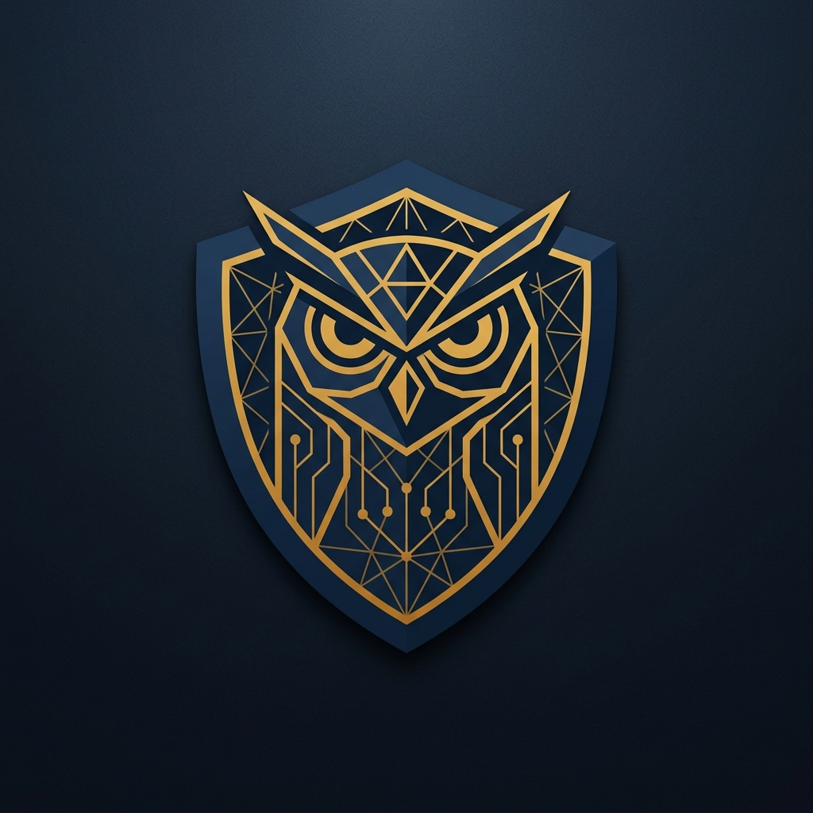
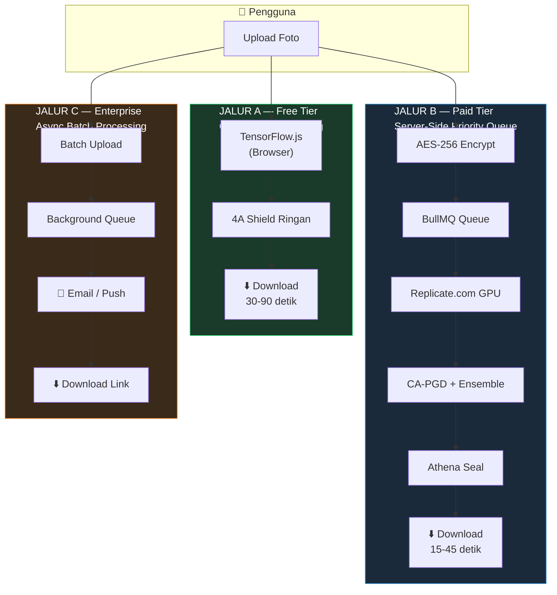
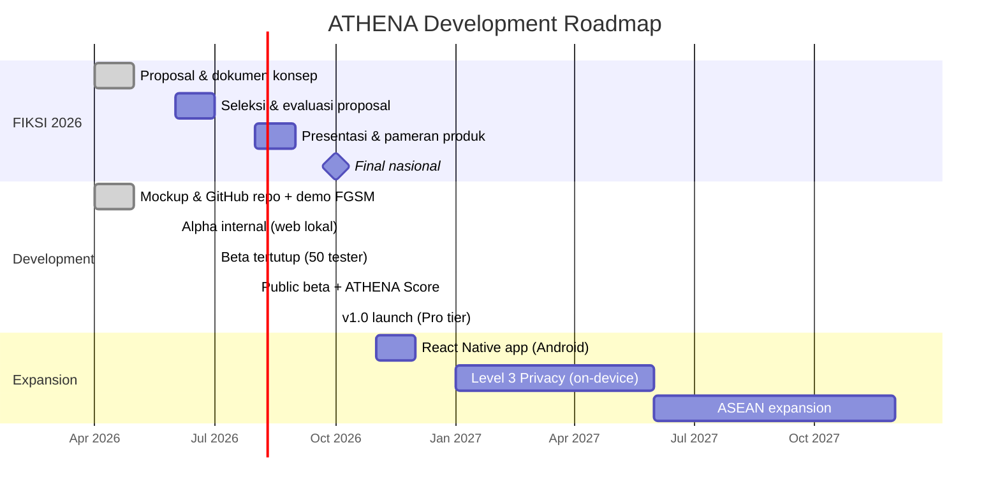

<p align="center">
  
</p>

<h1 align="center">A.T.H.E.N.A</h1>
<h4 align="center">Advanced Threat Handling & Encryption Network Application</h4>
<p align="center"><em>AI-Powered Visual Protection Platform for Indonesian Cultural Heritage</em></p>

<p align="center">
  <strong>「 Turn Your Image Into Invisible — Untrackable, Untrainable, Yours. 」</strong>
</p>

<br/>

<p align="center">
  <a href="#"></a>
  <a href="#"></a>
  <a href="#"></a>
  <a href="./LICENSE"></a>
</p>

<p align="center">
  
  
  
  
  
  
  
  
  
  
  
  
  
  
</p>

---

## Table of Contents

- [Executive Summary](#executive-summary)
- [The Problem](#the-problem)
- [Solution: 4A Shield](#solution-4a-shield)
- [System Architecture](#system-architecture)
- [Tech Stack](#tech-stack)
- [Business Model](#business-model)
- [Roadmap & Timeline](#roadmap--timeline)
- [Repository Structure](#repository-structure)
- [Quick Start](#quick-start)
- [For FIKSI Judges](#for-fiksi-judges)
- [Team](#team)
- [License](#license)

---

## Executive Summary

**ATHENA** is the first Indonesian SaaS platform that enables anyone — from batik artisans and wayang artists to content creators and everyday individuals — to **make their photos invisible to AI** using adversarial perturbation technology.

Inspired by the Greek **Goddess Athena** — symbol of **wisdom**, **strategic defense**, and **craftsmanship** — the platform embeds pixel-level modifications (≤ 8/255) that are invisible to the human eye but mathematically devastating to AI gradient descent.

> 💡 ATHENA is not just "photo protection" — it is a **digital fortress for Indonesian cultural heritage**, built by Indonesian students, for Indonesian artists and craftspeople.

### FIKSI 2026 Alignment

ATHENA uniquely intersects **two core pillars** of FIKSI 2026:

| Pillar | Implementation |
|--------|---------------|
| **Digital Technology** | AI/ML platform (React, NestJS, Python) built by PPLG students |
| **Creative Economy + Local Wisdom** | Protecting batik, tenun, songket, and carvings from global AI exploitation |

---

## The Problem

Every day, over **40 million photos** are uploaded by Indonesian users to digital platforms. Without their knowledge, these photos are scraped by global AI companies to train models.

<table>
<tr>
<td width="50%">

### 🧑‍🤝‍🧑 Individual & Gender Impact

- Women’s photos used to train **deepfake NSFW models** without consent
- Children’s photos become part of **foreign biometric databases**
- KBGO victims have photos manipulated by AI into explicit content

</td>
<td width="50%">

### 🎨 MSME & Creative Economy Impact

- **Batik tulis, tenun ikat, songket** patterns enter AI generative datasets
- AI can **replicate without paying** or obtaining artist permission
- Indonesian cultural visual heritage **exploited without compensation**

</td>
</tr>
</table>

### Scientific Foundation

| Research | Institution | Key Finding | ATHENA Implication |
|----------|-------------|-------------|-------------------|
| Witches Brew (2021) | Geiping et al. | Poisoning 0.1% training data = measurable accuracy drop | 100K ATHENA users = real impact on global AI models |
| Glaze (2023) | UChicago | Perturbation protects art style from AI post-compression | Validates compression-aware approach for 4A Shield |
| Nightshade (2023) | UChicago | 100 poisoned images = concept corruption in diffusion models | Realistic threshold for ATHENA’s network effect |
| JPEG-Resistant Adv. | Guo et al. (2018) | Perturbation can survive JPEG compression | Technical basis for CA-PGD in server-side Shield |

---

## Solution: 4A Shield

ATHENA embeds **adversarial perturbation** — invisible pixel modifications (≤ 8/255) — that disrupt AI gradient descent. Four layers work in synergy:

<table>
<tr>
<td align="center" width="25%">
<h3>🛡️ Anti-AI</h3>
<strong>Facial Recognition Blocking</strong><br/><br/>
Mencegah sistem pengenalan wajah AI mendeteksi identitas dalam foto
<br/><br/>
<em>Target: Pelajar, perempuan, siapapun khawatir identitas disalahgunakan</em>
</td>
<td align="center" width="25%">
<h3>🚫 Anti-NSFW</h3>
<strong>Manipulation Prevention</strong><br/><br/>
Mencegah manipulasi foto menjadi konten tidak pantas via generative AI
<br/><br/>
<em>Target: Korban KBGO, perempuan, kreator konten</em>
</td>
<td align="center" width="25%">
<h3>🎭 Anti-Deepfake</h3>
<strong>Synthesis Disruption</strong><br/><br/>
Memutus rantai data untuk sintesis video deepfake dari foto diam
<br/><br/>
<em>Target: Public figure lokal, kreator konten</em>
</td>
<td align="center" width="25%">
<h3>🔒 Anti-Training</h3>
<strong>Dataset Poisoning</strong><br/><br/>
Mencegah karya kreatif lokal dijadikan dataset training AI global
<br/><br/>
<em>Target: Pengrajin batik, seniman, UMKM kreatif</em>
</td>
</tr>
</table>

### Athena Seal — Invisible Watermark

Selain 4A Shield, ATHENA menyematkan **Athena Seal** — invisible forensic watermark berbasis DCT — sebagai **bukti kepemilikan digital** yang dapat dipresentasikan secara hukum berdasarkan UU Hak Cipta No. 28 Tahun 2014 dan UU ITE No. 11 Tahun 2008.

---

## System Architecture

ATHENA menggunakan **arsitektur tiga jalur** yang dirancang untuk skenario penggunaan berbeda:



| Jalur | Waktu Proses | Biaya Server | Privacy | Shield Quality |
|-------|-------------|-------------|---------|---------------|
| **A — Free** | 30-90 detik | Rp 0 (browser user) | 100% — foto tidak ke server | ~70-80% |
| **B — Paid** | 15-45 detik | Pay-per-use GPU | Encrypted + auto-delete < 24 jam | 100% (CA-PGD) |
| **C — Enterprise** | 10-60 menit (async) | Batch pricing | Encrypted + SLA 99.9% | 100% + custom model |

---

## Tech Stack

| Layer | Technology | Role |
|-------|-----------|------|
| **Frontend** | React 19 + Vite + TypeScript | Component-based PWA, strict type safety |
| **UI/Animation** | Framer Motion + GSAP + Lenis | Scroll-driven animations, smooth scrolling, micro-interactions |
| **3D/Visual** | Spline 3D + WebGL Shaders + Canvas | Immersive hero (black hole + star field + volumetric light rays) |
| **Backend API** | NestJS + TypeScript (Express) | Modular, enterprise-grade API with dependency injection |
| **Auth** | Supabase Auth (JWT) | Free up to 50K users |
| **Database** | PostgreSQL via Supabase | Persistent data: users, jobs, credits, subscriptions |
| **Cache & Queue** | Redis (Upstash) + BullMQ | Job queue, session, rate limiting |
| **ML Pipeline** | Python + PyTorch + torchattacks | CA-PGD, ensemble attack, JPEG simulation layer |
| **ML Cloud** | Replicate.com | Pay-per-use GPU inference |
| **ML Client** | TensorFlow.js + ONNX.js | Free tier: browser-side processing |
| **Storage** | Cloudflare R2 | S3-compatible, $0.015/GB |
| **Security** | AES-256 + ClamAV + magic bytes | Defense-in-depth at every upload layer |
| **Payment** | Midtrans | QRIS, GoPay, OVO, cards — widest coverage in Indonesia |
| **Deploy** | Vercel (frontend) + Railway (backend) | Global CDN, auto-deploy from GitHub |
| **CI/CD** | GitHub Actions | Automated test + deploy pipeline |
| **Monitoring** | BetterStack | Uptime, log aggregation, alerting |

> 📖 Detailed technical docs: **[Backend README](./TEKNIS/back_end/README.md)** | **[Frontend README](./TEKNIS/front_end/README.md)** | **[Full Context (530 lines)](./TEKNIS/konteks.md)**

---

## Business Model

<table>
<tr>
<td align="center" width="25%">
<h3>🆓 GRATIS</h3>
<strong>Rp 0 — Selamanya</strong>
<hr/>
5 foto/hari<br/>
Client-side (browser)<br/>
4A Shield ringan<br/>
Maks. 1080px<br/>
Watermark ATHENA<br/>
30-90 detik
<hr/>
<em>Pelajar, uji coba</em>
</td>
<td align="center" width="25%">
<h3>💳 KREDIT</h3>
<strong>Mulai Rp 5.000</strong>
<hr/>
50 foto per Rp 5.000<br/>
Server-side CA-PGD<br/>
4A Shield standar<br/>
Maks. 4K resolusi<br/>
15-45 detik<br/>
Berlaku 90 hari
<hr/>
<em>Pengrajin UMKM, kreator</em>
</td>
<td align="center" width="25%">
<h3>⭐ PRO</h3>
<strong>Rp 29.000/bulan</strong>
<hr/>
Unlimited foto<br/>
CA-PGD + Ensemble<br/>
4A Shield + Athena Seal<br/>
Maks. 8K resolusi<br/>
Batch upload (20)<br/>
Tanpa watermark
<hr/>
<em>Kreator aktif, fotografer</em>
</td>
<td align="center" width="25%">
<h3>🏢 ENTERPRISE</h3>
<strong>Custom Pricing</strong>
<hr/>
Unlimited + bulk async<br/>
Dedicated API access<br/>
White-label option<br/>
SLA 99.9%<br/>
Custom surrogate model<br/>
Priority support
<hr/>
<em>UMKM menengah, agensi</em>
</td>
</tr>
</table>

### Proyeksi Keuangan 12 Bulan

| Bulan | User Aktif | Pendapatan Est. | Biaya Est. | Profit Est. |
|-------|-----------|----------------|-----------|------------|
| 1-2 | 200 | Rp 500K | Rp 150K | Rp 350K |
| 3-4 | 800 | Rp 2.290K | Rp 600K | Rp 1.690K |
| 5-6 | 2.500 | Rp 6.450K | Rp 1.500K | Rp 4.950K |
| 7-9 | 6.000 | Rp 17.800K | Rp 4.000K | Rp 13.800K |
| 10-12 | 12.000 | Rp 35.000K | Rp 9.000K | Rp 26.000K |

> Gross margin 91-97% untuk paid tier berkat arsitektur pay-per-use (Replicate.com).

---

## Roadmap & Timeline



### Milestone Detail

| Timeline | Milestone | Deliverable |
|----------|-----------|-------------|
| **Mei 2026** | FIKSI submission | Mockup Figma + GitHub repo + demo FGSM dasar |
| **Juni 2026** | Alpha internal | Web app lokal: upload, FGSM Shield, download, auth + kredit |
| **Juli 2026** | Beta tertutup | PWA deployed, TF.js free tier, 50 beta tester |
| **Agustus 2026** | Public beta | Kredit tier live, ATHENA Score dashboard, CA-PGD server-side |
| **Oktober 2026** | v1.0 launch | Pro subscription, Athena Seal, batch upload, notifikasi |
| **Desember 2026** | Mobile app | React Native Android, TF Lite client-side |
| **Q2 2027** | Level 3 Privacy | Full on-device, server hanya license validation |

---

## Repository Structure

```
ATHENA — FIKSI 2026/
│
├── 📄 README.md                       ← You are here
├── 📄 LICENSE                         ← Proprietary license
├── 📄 .gitignore
│
├── 📂 ADMINISTRASI/                   ← Official FIKSI documents
│   ├── 📄 README.md
│   ├── 📑 ATHENA_Deskripsi_Produk.pdf
│   ├── 📑 ATHENA_Analisis_SWOT.pdf
│   ├── 📑 ATHENA_Channel_Strategy.pdf
│   ├── 📊 ATHENA_HPP_Produk.xlsx
│   └── 📂 _source/                   ← Editable .docx source files
│
├── 📂 PANDUAN/                        ← FIKSI competition guidelines
│   ├── 📄 README.md
│   └── 📑 Panduan_FIKSI_2026.pdf
│
├── 📂 TEKNIS/                         ← Technical components
│   ├── 📄 README.md                   ← Architecture & system diagrams
│   ├── 📄 konteks.md                  ← Full 530-line context document
│   ├── 📂 back_end/                   ← NestJS API Server
│   │   ├── 📄 README.md              ← ERD, API endpoints, architecture
│   │   └── 📂 src/                   ← Source code (TypeScript)
│   └── 📂 front_end/                 ← Vite + React + GSAP
│       ├── 📄 README.md              ← UI stack, components, design system
│       └── 📂 src/                   ← Source code (TSX + CSS)
│
└── 📂 docs/                           ← Documentation assets
    └── 📂 images/
        └── 🖼️ athena-logo.png
```

---

## Quick Start

### Prerequisites

- **Node.js** >= 18.x and **npm** >= 9.x
- **Git** for version control

### Frontend (Vite + React)

```bash
cd TEKNIS/front_end
npm install
npm run dev              # Development → http://localhost:5173
```

### Backend (NestJS)

```bash
cd TEKNIS/back_end
npm install
cp .env.example .env     # Configure environment variables
npm run start:dev        # Development → http://localhost:3000
```

> 📖 Full env docs: [Backend](./TEKNIS/back_end/README.md#environment-variables) | [Frontend](./TEKNIS/front_end/README.md#getting-started)

---

## For FIKSI Judges

Thank you for evaluating ATHENA. Here’s a navigation guide:

### Recommended Reading Order

| Priority | Document | Content |
|----------|----------|---------|
| 🥇 | **This README** | Complete product overview, architecture, roadmap |
| 🥈 | [konteks.md](./TEKNIS/konteks.md) | Full 530-line deep-dive: philosophy, strategy, honest analysis |
| 🥉 | [Backend README](./TEKNIS/back_end/README.md) | ERD (8 tables), 17 API endpoints, module architecture |
| 4 | [Frontend README](./TEKNIS/front_end/README.md) | UI/UX stack, component architecture, client-side ML |
| 5 | [Product Description](./ADMINISTRASI/ATHENA_Deskripsi_Produk.pdf) | Official FIKSI 2026 submission document |

### Technical Verification

| What to Verify | How |
|----------------|-----|
| **Frontend builds** | `cd TEKNIS/front_end && npm run build` |
| **Backend builds** | `cd TEKNIS/back_end && npm run build` |
| **API documentation** | Run backend → `http://localhost:3000/docs` (Swagger UI) |
| **Live frontend** | Run frontend → `http://localhost:5173` |
| **ERD & Database** | See [Backend README → ERD](./TEKNIS/back_end/README.md#entity-relationship-diagram) |
| **Scientific refs** | See [konteks.md](./TEKNIS/konteks.md) sections 5.2 and 6.2 |

### Development Status

| Component | Status | Notes |
|-----------|--------|-------|
| Concept docs & proposal | ✅ Complete | 530 lines of technical context + FIKSI docs |
| Repository structure | ✅ Complete | Fully organized with comprehensive documentation |
| Backend scaffold (NestJS) | ✅ Complete | Modular architecture, Swagger UI, typed DTOs |
| Frontend landing page | ✅ Complete | Spline 3D + StarField + LightRays + Lenis smooth scroll |
| Login/Auth UI | ✅ Complete | Social login (Google, X, Apple) + email/password |
| ERD & database design | ✅ Complete | 8 tables with full relations |
| API endpoint design | ✅ Complete | 17 endpoints documented |
| ML pipeline design | 📋 Planned | CA-PGD + ensemble, paper references available |
| Working prototype | 🔜 Jun 2026 | Alpha internal target next month |
| Beta deployment | 🔜 Jul 2026 | PWA + 50 beta testers |

---

## Team

| Role | Name | Contribution |
|------|------|--------------|
| Founder & Lead Developer | *[Name]* | System architecture, backend, ML pipeline |
| UI/UX & Frontend | *[Name]* | React PWA, design system, user research |
| Business & Strategy | *[Name]* | Business model, GTM strategy, partnerships |

> The ATHENA team consists of PPLG students building real projects with modern stacks. We know clearly what we can build now and what we’ll strengthen with technical partners in the next 6 months.

---

## License

This project is licensed under a **proprietary license**. See the [LICENSE](./LICENSE) file for full details.

Repository access is granted to FIKSI 2026 judges and organizing committee for evaluation purposes.

---

<p align="center">
  
  <br/>
  <strong>A.T.H.E.N.A</strong><br/>
  <em>Advanced Threat Handling & Encryption Network Application</em><br/><br/>
  <strong>「 The Wisdom to Protect Your Privacy. 」</strong><br/><br/>
  <sub>Melindungi Karya & Identitas Digital Indonesia</sub><br/>
  <sub>Festival Inovasi & Kewirausahaan Siswa Indonesia (FIKSI) 2026</sub><br/>
  <sub>Bidang: Teknologi Digital | Pilar: Ekonomi Digital + Ekonomi Kreatif Berbasis Kearifan Lokal</sub>
</p>
