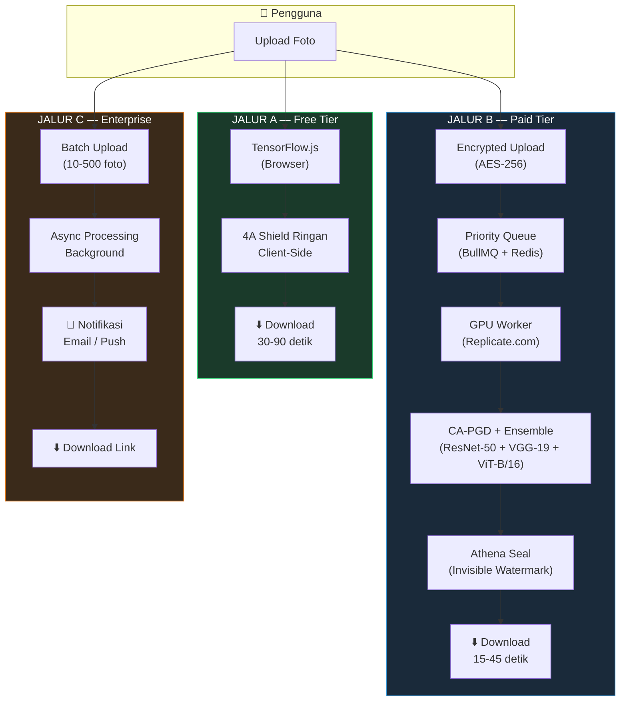
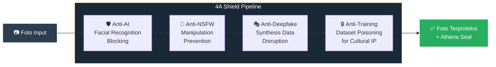
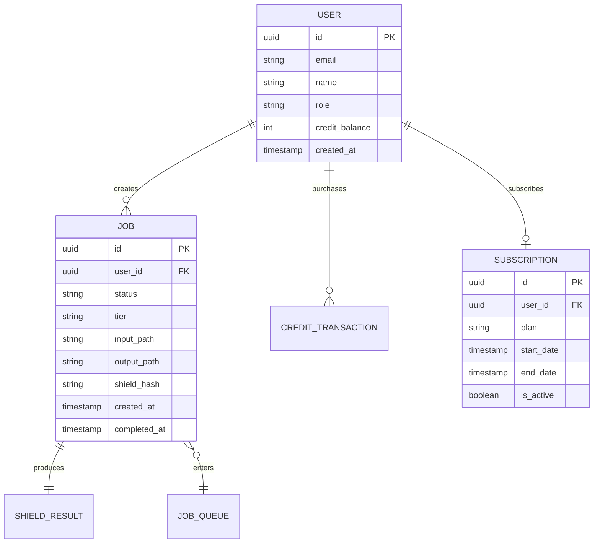

# ⚙️ Teknis — Arsitektur & Implementasi ATHENA

Folder ini berisi seluruh komponen teknis proyek ATHENA, mulai dari dokumen konteks hingga source code backend dan frontend.

---

## Struktur

```
TEKNIS/
├── konteks.md          ← Dokumen konteks teknis lengkap ATHENA
├── back_end/           ← NestJS + TypeScript — API Server
└── front_end/          ← Vite + React + TypeScript — Web Client (PWA)
```

| Komponen | Teknologi | Deskripsi |
|----------|-----------|-----------|
| [Konteks Teknis](./konteks.md) | Markdown | Dokumen lengkap yang mencakup filosofi, arsitektur, model bisnis, dan roadmap ATHENA |
| [Backend API](./back_end/) | NestJS, TypeScript, PostgreSQL, Redis | Server-side API: auth, job queue, payment, ML pipeline orchestration |
| [Frontend Client](./front_end/) | Vite, React, TypeScript | Progressive Web App: UI/UX, client-side 4A Shield (TF.js), real-time dashboard |

---

## Arsitektur Sistem — Tiga Jalur Pemrosesan

ATHENA menggunakan arsitektur **tiga jalur** yang dirancang untuk skenario penggunaan yang berbeda:



## Pipeline 4A Shield

Empat lapisan perlindungan yang bekerja secara sinergis:



## Entity Relationship Diagram (Preview)

ERD lengkap tersedia di [dokumentasi backend](./back_end/README.md). Berikut adalah preview:



---

## Quick Start

### Backend

```bash
cd back_end
npm install
cp .env.example .env    # Configure environment variables
npm run start:dev        # Development server at http://localhost:3000
```

### Frontend

```bash
cd front_end
npm install
cp .env.example .env    # Configure environment variables
npm run dev             # Development server at http://localhost:5173
```

> Lihat README masing-masing folder untuk dokumentasi detail.

---

<p align="center">
  <sub>ATHENA — Advanced Threat Handling & Encryption Network Application</sub><br>
  <sub>FIKSI 2026 | Teknologi Digital</sub>
</p>
