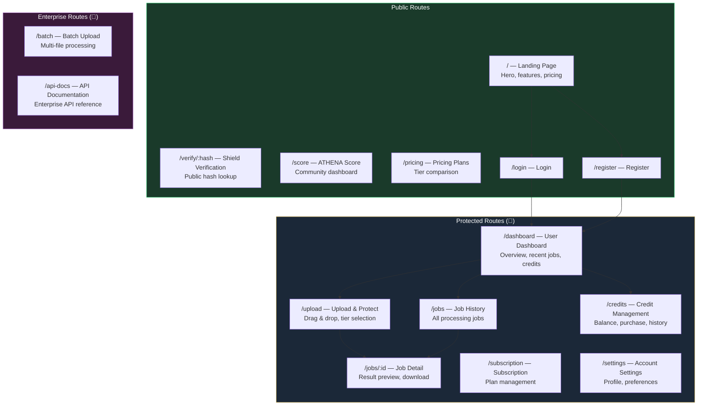
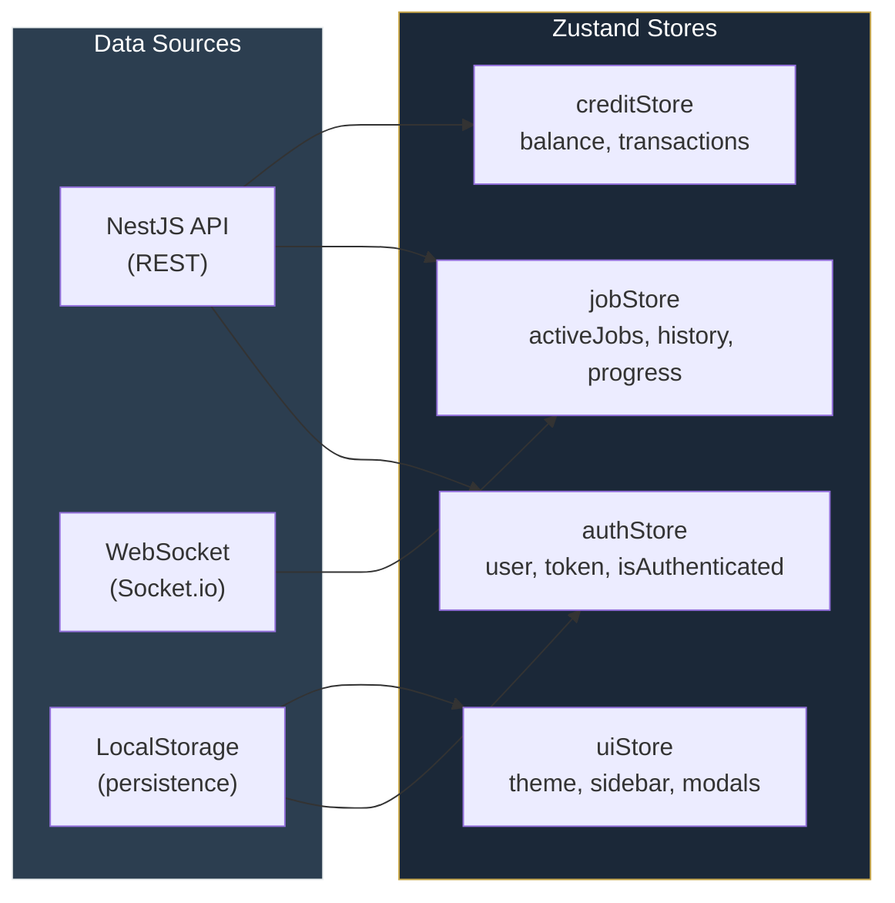
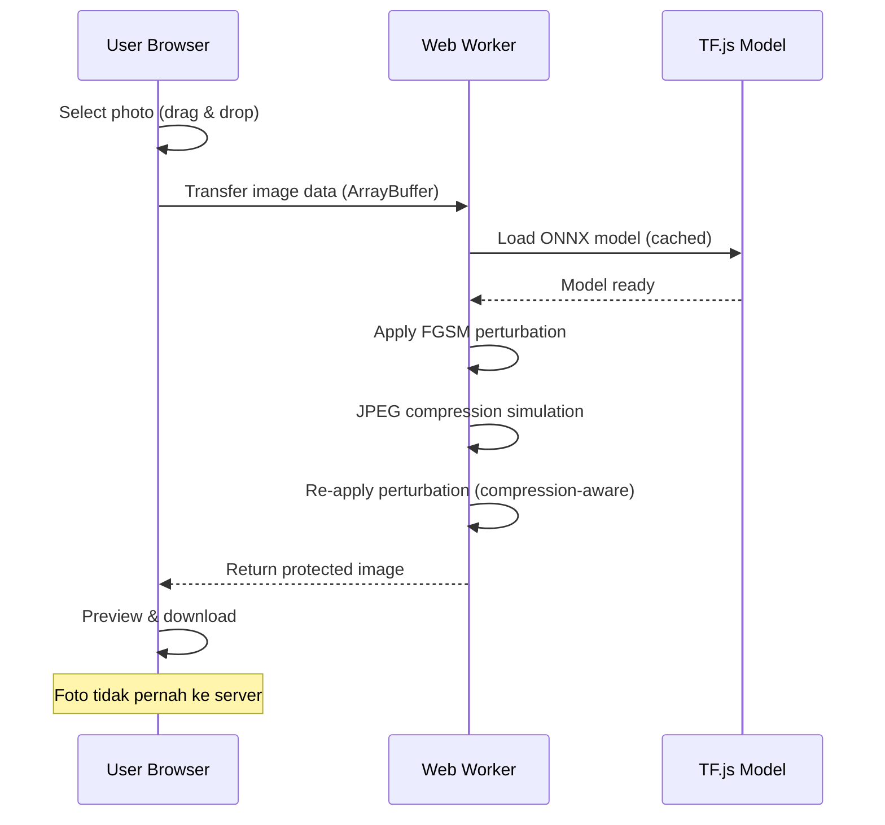

# 🎨 ATHENA Frontend — Web Client (PWA)

<p align="center">
  
  
  
  
  
  
</p>

Progressive Web App untuk platform ATHENA. Dibangun dengan **Vite + React + TypeScript** — mendukung client-side 4A Shield processing (TensorFlow.js) untuk free tier dan real-time job tracking via WebSocket untuk paid tier.

---

## Daftar Isi

- [Fitur Utama](#fitur-utama)
- [Tech Stack](#tech-stack)
- [Halaman & Routing](#halaman--routing)
- [Arsitektur Komponen](#arsitektur-komponen)
- [State Management](#state-management)
- [Client-Side ML Processing](#client-side-ml-processing)
- [PWA Configuration](#pwa-configuration)
- [Design System](#design-system)
- [Getting Started](#getting-started)

---

## Fitur Utama

| Fitur | Deskripsi | Tier |
|-------|-----------|------|
| **Drag & Drop Upload** | Upload foto dengan drag-and-drop atau click-to-browse | Semua |
| **Client-Side 4A Shield** | Pemrosesan perturbasi langsung di browser via TensorFlow.js | Free |
| **Real-Time Progress** | WebSocket progress bar untuk server-side processing | Paid |
| **Shield Result Preview** | Before/after comparison dengan slider interaktif | Semua |
| **ATHENA Score Dashboard** | Dashboard publik dampak kolektif komunitas ATHENA | Publik |
| **Credit Management** | Beli, pantau, dan gunakan kredit dengan integrasi Midtrans | Credit+ |
| **Batch Upload** | Upload dan proses banyak foto sekaligus | Enterprise |
| **Shield Hash Verification** | Verifikasi publik bahwa foto telah dihapus dari server | Publik |
| **PWA Install** | Installable di home screen, push notification, offline cache | Semua |
| **Responsive Design** | Optimal di desktop, tablet, dan mobile | Semua |

---

## Tech Stack

| Layer | Teknologi | Peran |
|-------|-----------|-------|
| Build Tool | Vite 6 | HMR, ESM native, build optimization |
| UI Framework | React 19 + TypeScript | Component-based UI, strict type safety |
| Styling | TailwindCSS 4 | Utility-first CSS, responsive design |
| State | Zustand | Lightweight global state (auth, credits, jobs) |
| Routing | React Router 7 | SPA navigation, protected routes, lazy loading |
| HTTP Client | Axios | API communication, interceptors, retry logic |
| Real-time | Socket.io Client | WebSocket untuk job progress real-time |
| Client ML | TensorFlow.js + ONNX.js | Free tier: 4A Shield ringan di browser |
| Forms | React Hook Form + Zod | Form validation, type-safe schemas |
| Animation | Framer Motion | Smooth page transitions, micro-animations |
| PWA | Workbox (vite-plugin-pwa) | Service worker, offline cache, installable |
| Testing | Vitest + Testing Library | Unit & integration tests |

---

## Halaman & Routing



### Daftar Halaman

| Route | Halaman | Deskripsi | Auth |
|-------|---------|-----------|------|
| `/` | Landing Page | Hero section, fitur 4A Shield, pricing preview, CTA | — |
| `/login` | Login | Supabase Auth login (email/password, Google OAuth) | — |
| `/register` | Register | Registrasi user baru | — |
| `/verify/:hash` | Shield Verification | Input Shield Hash, verifikasi publik | — |
| `/score` | ATHENA Score | Dashboard dampak kolektif (counter, leaderboard, breakdown) | — |
| `/pricing` | Pricing | Perbandingan tier (Free, Credit, Pro, Enterprise) | — |
| `/dashboard` | User Dashboard | Overview: kredit, job terbaru, statistik penggunaan | 🔑 |
| `/upload` | Upload & Protect | Drag-and-drop upload, pilihan tier, progress real-time | 🔑 |
| `/jobs` | Job History | Daftar semua job dengan filter dan search | 🔑 |
| `/jobs/:id` | Job Detail | Before/after preview, download, Shield Hash | 🔑 |
| `/credits` | Credits | Saldo, beli kredit (Midtrans), riwayat transaksi | 🔑 |
| `/subscription` | Subscription | Kelola langganan Pro/Enterprise | 🔑 |
| `/settings` | Settings | Profil, preferensi, keamanan akun | 🔑 |
| `/batch` | Batch Upload | Upload batch untuk Enterprise (10-500 foto) | 🏢 |

---

## Arsitektur Komponen

```
src/
├── main.tsx                       ← Entry point
├── App.tsx                        ← Root component + router
├── index.css                      ← Global styles + Tailwind directives
│
├── assets/                        ← Static assets (images, fonts)
│   └── athena-logo.svg
│
├── components/                    ← Reusable UI components
│   ├── ui/                        ← Primitives (Button, Input, Card, Modal)
│   │   ├── Button.tsx
│   │   ├── Card.tsx
│   │   ├── Input.tsx
│   │   ├── Modal.tsx
│   │   ├── Badge.tsx
│   │   ├── ProgressBar.tsx
│   │   └── Skeleton.tsx
│   │
│   ├── layout/                    ← Layout components
│   │   ├── Navbar.tsx
│   │   ├── Sidebar.tsx
│   │   ├── Footer.tsx
│   │   └── PageContainer.tsx
│   │
│   ├── shield/                    ← Shield-specific components
│   │   ├── UploadZone.tsx         ← Drag & drop area
│   │   ├── ShieldProgress.tsx     ← Real-time progress (WebSocket)
│   │   ├── ResultPreview.tsx      ← Before/after slider
│   │   ├── ShieldBadge.tsx        ← 4A Shield status badge
│   │   └── HashVerifier.tsx       ← Public verification input
│   │
│   ├── dashboard/                 ← Dashboard components
│   │   ├── StatsCard.tsx
│   │   ├── RecentJobs.tsx
│   │   ├── CreditGauge.tsx
│   │   └── QuickActions.tsx
│   │
│   └── score/                     ← ATHENA Score components
│       ├── ScoreCounter.tsx       ← Animated counter
│       ├── CommunityMap.tsx       ← Geographic breakdown
│       └── Leaderboard.tsx        ← Community ranking
│
├── pages/                         ← Page components (route-level)
│   ├── Landing.tsx
│   ├── Login.tsx
│   ├── Register.tsx
│   ├── Dashboard.tsx
│   ├── Upload.tsx
│   ├── Jobs.tsx
│   ├── JobDetail.tsx
│   ├── Credits.tsx
│   ├── Subscription.tsx
│   ├── Settings.tsx
│   ├── Score.tsx
│   ├── Pricing.tsx
│   ├── Verify.tsx
│   └── BatchUpload.tsx
│
├── hooks/                         ← Custom React hooks
│   ├── useAuth.ts                 ← Authentication state & actions
│   ├── useShield.ts               ← Shield processing logic
│   ├── useCredits.ts              ← Credit balance & transactions
│   ├── useWebSocket.ts            ← WebSocket connection manager
│   └── useClientML.ts             ← TensorFlow.js model loading & inference
│
├── stores/                        ← Zustand stores
│   ├── authStore.ts               ← User auth state
│   ├── jobStore.ts                ← Active jobs & history
│   ├── creditStore.ts             ← Credit balance
│   └── uiStore.ts                 ← UI state (sidebar, modals, theme)
│
├── services/                      ← API service layer
│   ├── api.ts                     ← Axios instance + interceptors
│   ├── authService.ts
│   ├── shieldService.ts
│   ├── creditService.ts
│   ├── paymentService.ts
│   ├── scoreService.ts
│   └── subscriptionService.ts
│
├── ml/                            ← Client-side ML (Free Tier)
│   ├── modelLoader.ts             ← TensorFlow.js model management
│   ├── shieldProcessor.ts         ← Client-side 4A Shield pipeline
│   └── workers/                   ← Web Workers for heavy computation
│       └── shieldWorker.ts
│
├── lib/                           ← Utility functions
│   ├── constants.ts
│   ├── formatters.ts
│   └── validators.ts
│
└── types/                         ← TypeScript type definitions
    ├── user.ts
    ├── job.ts
    ├── credit.ts
    └── shield.ts
```

---

## State Management

ATHENA menggunakan **Zustand** untuk state management — ringan, TypeScript-first, dan tanpa boilerplate.



---

## Client-Side ML Processing

Untuk **free tier**, ATHENA menjalankan 4A Shield ringan langsung di browser pengguna menggunakan TensorFlow.js. Foto **tidak pernah dikirim ke server** — menghilangkan privacy paradox sepenuhnya.



### Spesifikasi Client-Side

| Parameter | Value |
|-----------|-------|
| Model | MobileNet v2 (quantized, ~5MB) |
| Perturbation | FGSM (epsilon ≤ 8/255) |
| Processing Time | 30-90 detik (tergantung device) |
| Efektivitas vs Server | ~70-80% |
| Max Resolution | 1080px |
| Privacy | 100% — zero server contact |

---

## PWA Configuration

ATHENA frontend dikonfigurasi sebagai **Progressive Web App** menggunakan `vite-plugin-pwa` + Workbox:

| Feature | Status | Deskripsi |
|---------|--------|-----------|
| Installable | ✅ | Add to Home Screen di mobile & desktop |
| Offline Cache | ✅ | App shell + static assets cached |
| Push Notification | 🔜 Phase 1 | Job completion notification |
| Background Sync | 🔜 Phase 2 | Resume upload saat kembali online |
| Share Target | 🔜 Phase 2 | Share foto langsung ke ATHENA dari gallery |

---

## Design System

### Color Palette

| Token | Value | Usage |
|-------|-------|-------|
| `--athena-navy` | `#1B2838` | Primary background, headers |
| `--athena-gold` | `#C9A84C` | Accent, CTAs, highlights |
| `--athena-dark` | `#0F1923` | Deep background |
| `--athena-light` | `#E8E6E1` | Text on dark bg |
| `--athena-success` | `#2ECC71` | Success states, free tier |
| `--athena-info` | `#3498DB` | Info states, paid tier |
| `--athena-warning` | `#F39C12` | Warning states |
| `--athena-danger` | `#E74C3C` | Error states, destructive actions |

### Typography

| Element | Font | Weight | Size |
|---------|------|--------|------|
| Heading | Inter | 700 | 2rem — 3.5rem |
| Body | Inter | 400 | 0.875rem — 1rem |
| Code | JetBrains Mono | 400 | 0.875rem |
| Badge | Inter | 600 | 0.75rem |

---

## Getting Started

### Prerequisites

- Node.js >= 18.x
- npm >= 9.x

### Installation

```bash
# Masuk ke direktori frontend
cd TEKNIS/front_end

# Install dependencies
npm install

# Copy environment variables
cp .env.example .env

# Jalankan development server
npm run dev
```

Development server akan berjalan di `http://localhost:5173`.

### Environment Variables

```env
# API
VITE_API_BASE_URL=http://localhost:3000/api/v1
VITE_WS_URL=ws://localhost:3000

# Supabase (Public)
VITE_SUPABASE_URL=https://your-project.supabase.co
VITE_SUPABASE_ANON_KEY=your-anon-key

# Midtrans (Client)
VITE_MIDTRANS_CLIENT_KEY=your-client-key

# Feature Flags
VITE_ENABLE_CLIENT_ML=true
VITE_ENABLE_PWA=true
```

### Scripts

| Command | Deskripsi |
|---------|-----------|
| `npm run dev` | Development server (HMR) |
| `npm run build` | Production build |
| `npm run preview` | Preview production build locally |
| `npm run lint` | Lint codebase |
| `npm run test` | Jalankan unit tests |

---

<p align="center">
  <sub>ATHENA Frontend — Built with Vite + React + TypeScript</sub><br>
  <sub>FIKSI 2026 | Teknologi Digital</sub>
</p>
